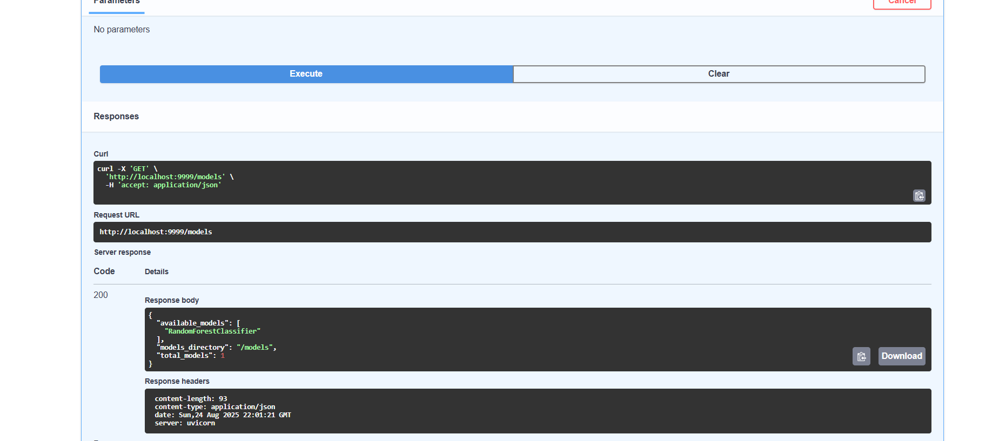

# MlOps_Taller2
Grupo compuesto por Sebastian Rodríguez y David Córdova
# Taller: Predicción de Especies de Pingüinos con FastAPI y Docker

Este proyecto abarca desde el entrenamiento de modelos de **Machine Learning** con Jupyter, hasta el despliegue de una API REST con **FastAPI** que permite hacer predicciones sobre nuevas observaciones de pingüinos.

## Estructura del Proyecto

La estructura del proyecto está organizada en dos partes principales: **Jupyter** para la preparación de modelos y **API** para el despliegue y uso de los modelos entrenados.

```
proyecto-pinguinos/
├── api/
│   ├── models/
│   ├── Dockerfile
│   ├── main.py
│   ├── pyproject.toml
│   ├── README.md
│   └── uv.lock
├── Jupyter/
│   ├── notebooks/
│   ├── crea_modelos.py
│   ├── limpieza.py
│   ├── Dockerfile
│   ├── pyproject.toml
│   ├── README.md
│   └── uv.lock
── docker-compose.yml
│  
── models/


### Descripción de Componentes

- **Jupyter**:
  - **crea_modelos.py**: Script para la creación y entrenamiento de modelos, se puede desplegar en un notebook de Jupyter si es necesario.
  - **limpieza.py**: Script para la limpieza y preparación de datos.
  - **notebooks/**: Carpeta con notebooks para exploración de datos y análisis.

- **API**:
  - **main.py**: Archivo principal para la implementación de la API con FastAPI.
  - **models/**: Carpeta con los modelos entrenados en formato pickle.
  - **Dockerfile**: Contenerización de la API.
  - **pyproject.toml**: Dependencias y configuración del proyecto.
  - **README.md**: Documentación de la API.

- **docker-compose.yml**:  
  Archivo de orquestación que define y gestiona los contenedores del proyecto.  
  - Permite levantar de manera simultánea los servicios de **Jupyter** y de la **API**, conectándolos en la misma red interna.  
  - Facilita el montaje de volúmenes para compartir los **modelos entrenados** entre Jupyter y la API.  
  - Incluye la configuración de dependencias, variables de entorno y puertos expuestos para el acceso desde el host.

- **models/**:  
  Carpeta común ubicada en la raíz del proyecto que almacena los **modelos entrenados** en formato **pickle (.pkl)**.  
  - Es compartida como volumen tanto por el contenedor de **Jupyter** como por el de la **API**, garantizando que los modelos entrenados puedan ser usados inmediatamente por la API sin necesidad de copiarlos manualmente.  
  - Generalmente contiene archivos como:  
    - `logistic_regression.pkl`  
    - `decision_tree.pkl`  
    - `knn.pkl`  

---

## 1. Entrenamiento de Modelos (Jupyter)

En esta sección se encuentran los scripts que realizan la **limpieza de datos** y el **entrenamiento de modelos** de **Machine Learning**.

### Limpieza de Datos
- **limpieza.py**: Realiza el preprocesamiento de los datos, como la eliminación de valores nulos y la codificación de variables categóricas.

### Creación de Modelos
- **crea_modelos.py**: Entrena modelos de clasificación (Regresión logística, Árbol de decisión y KNN) utilizando el conjunto de datos de **palmerpenguins**.  
  Los modelos entrenados se guardan en la carpeta **models/** en formato **pickle**.

---

## 2. Despliegue de Modelos (API)

La API implementada con **FastAPI** permite cargar los modelos previamente entrenados y exponer endpoints para realizar predicciones.

- Los modelos se leen directamente desde la carpeta **models/**.
- Se pueden consumir los endpoints para obtener predicciones de especies de pingüinos a partir de características como longitud y profundidad del pico, longitud de la aleta y masa corporal.


---

## 3. Contenerización con Docker

Tanto la parte de la **API** como la de **Jupyter** están creadas en un contenedor con docker desplegado mediante compose  para mayor facilidad.

```

### Dockerfile para Jupyter
El archivo **Dockerfile** en la carpeta **Jupyter/** define el entorno para la creación de los modelos
```dockerfile
# Imagen base ligera de Python
FROM python:3.12-slim
 
# Crear directorios
RUN mkdir -p /bases_modelo /encoder
 
# Copiar dependencias
COPY pyproject.toml uv.lock ./
 
# Instalar pip y uv
RUN pip install --upgrade pip \
&& pip install uv
 
# Instalar dependencias directamente en el sistema
RUN uv pip install -r pyproject.toml --system
 
# Directorio de trabajo
WORKDIR /app
 
# Copiar scripts
COPY crea_modelos.py .
COPY limpieza.py .
 
# Exponer puerto de Jupyter
EXPOSE 8888
 
# Arrancar Jupyter con Python del sistema
CMD ["jupyter", "lab", "--ip=0.0.0.0", "--port=8888", "--allow-root", "--NotebookApp.token="]
```


### Dockerfile para API
El archivo **Dockerfile** en la carpeta **api/** define la imagen para que corra la aplicación que consume los modelos.
```dockerfile
# Imagen base
FROM python:3.12-slim

# Directorio de trabajo dentro del contenedor
WORKDIR /app
RUN mkdir /models

# Copiamos pyproject.toml y el lockfile de uv
COPY pyproject.toml uv.lock ./

# Instalamos uv
RUN pip install --upgrade pip \
    && pip install uv

RUN uv sync --frozen

COPY . .

# Exponemos el puerto de Uvicorn 
EXPOSE 9999

# Comando para levantar tu API con Uvicorn usando uv
# Ajusta main:app según tu archivo FastAPI
CMD ["uv", "run", "uvicorn", "main:app", "--host", "0.0.0.0", "--port", "9999"]
```
---

## 4. Ejecución del Proyecto

1. **Levantamiento de la aplicación**:
```bash
docker compose down -v
docker compose build
docker compose up
```
API → http://localhost:9999/docs

Jupyter Notebook → http://localhost:8888


2. **Verificación de los modelos**:


*Figura 1: Verificación de los modelos iniciales antes del entrenamiento*

3. **Entorno de gestión de datos y entrenamiento de modelos**:


Figura 2: Verificación de del entorno de jupyter lab*


2. **Ejecución del código para la limpieza y transformación de dataset**:


Figura 3: Limpieza y transformación de los datos*

4. **Entrenamiento y almacenamiento del modelo clasificación**:


Figura 4: Entrenamiento del modelo*

5. **Verificación de los modelos disponibles en FASTAPI**:


Figura 5: Modelos disponibles


6. **Predicción usando el modelo generado en JupyterLab**:


Figura 6: Predicción del modelo


### Programas usados para la limpieza de los datos y el entrenamiento del modeo en Jupyter
Para entrenar los modelos, sigue estos pasos:

1. **Script de limpieza  y transformación de datos**:
 ```python
 import palmerpenguins as pp
import pandas as pd
import joblib
import numpy as np
from sklearn.preprocessing import LabelEncoder
from sklearn.model_selection import train_test_split
from sklearn.ensemble import RandomForestClassifier
from sklearn.metrics import accuracy_score, classification_report
from sklearn.metrics import confusion_matrix, ConfusionMatrixDisplay
from sklearn.preprocessing import OneHotEncoder

df = pp.load_penguins()
df.head()
df[df.isna().any(axis=1)]
df.dropna(inplace=True)
categorical_cols = ['sex','island']
encoder = OneHotEncoder( handle_unknown='ignore')
x = df.drop(columns=['species'])
y = df['species']
x_encoded = encoder.fit_transform(x[categorical_cols])
X_numeric = x.drop(columns=categorical_cols)
X_final = np.hstack((X_numeric.values, x_encoded.toarray()))

df_encoded = pd.get_dummies(df, columns=['island','sex'])
bool_cols = df_encoded.select_dtypes(include='bool').columns
df_encoded[bool_cols] = df_encoded[bool_cols].astype(int)
df_encoded.head()
df_encoded['species'] = df_encoded['species'].apply(lambda x: 
1 if x == 'Adelie' else 
2 if x == 'Chinstrap' else 
3 if x == 'Gentoo' else 
None)
df_encoded.to_csv('/bases_modelo/base_penguin.csv', index = False)
print('Base exportada con éxito')

   ```

2. **Script de entrenamiento de los modelos de clasificación**:
   
 ```python
 import pandas as pd
import joblib
import numpy as np
from sklearn.preprocessing import LabelEncoder
from sklearn.model_selection import train_test_split
from sklearn.ensemble import RandomForestClassifier
from sklearn.linear_model import LogisticRegression  # Modelo regresión logística.
from sklearn.neighbors import KNeighborsClassifier  # Modelo KNN.
from sklearn.tree import DecisionTreeClassifier  # Árbol de decisión.
from sklearn.metrics import accuracy_score, classification_report
from sklearn.metrics import confusion_matrix, ConfusionMatrixDisplay
from sklearn.preprocessing import OneHotEncoder

df = pd.read_csv('/bases_modelo/base_penguin.csv')
df = pd.DataFrame(df)
X = df.drop('species', axis=1)
Y = df['species']
X_train, X_test, Y_train, Y_test = train_test_split(
    X, Y, test_size=0.2, random_state=42)

model = KNeighborsClassifier()
model.fit(X_train, Y_train)
y_pred = model.predict(X_test)
print("Accuracy:", accuracy_score(Y_test, y_pred))
joblib.dump(model, '/models/KNeighborsClassifier.pkl')
print('Modelo Exportado Exitosamente')

   ```

3. **Se guardan los modelos dentro del container para que la API los pueda consumir**:


## 5. Endpoints Disponibles

- **GET** `/`: Página de bienvenida
- **POST** `/predict`: Endpoint de predicción
- **GET** `/docs`: Documentación interactiva (Swagger UI)
- **GET** `/redoc`: Documentación alternativa (ReDoc)
- **GET** `/health`: Endpoint de health check


## 6. Tecnologías Utilizadas

- **Machine Learning**: scikit-learn, pandas, numpy
- **API Framework**: FastAPI, Pydantic, Uvicorn
- **Contenerización**: Docker, Docker Compose
- **Data Source**: palmerpenguins dataset
- **Serialización**: pickle para persistencia de modelos
